# Real Estate Platform - System Architecture Block Diagram

```mermaid
---
title: Real Estate Platform - System Architecture Block Diagram
---
block-beta
  columns 5
  
  %% Frontend Layer
  FrontendTitle["🌐 FRONTEND LAYER"] space space space space
  
  %% User Interface Blocks
  BuyerUI["👤 Buyer Panel<br/>- Property Search<br/>- Tour Requests<br/>- Watchlist<br/>- Offers"] space SellerUI["🏠 Seller Panel<br/>- Add Properties<br/>- Manage Tours<br/>- View Offers<br/>- Community"] space AgentUI["🏢 Agent Panel<br/>- Client Management<br/>- Communication<br/>- Assignments"]
  
  AdminUI["⚙️ Admin Panel<br/>- Approve Properties<br/>- User Management<br/>- System Control"] space space space space
  
  %% React Components Layer
  ReactTitle["⚛️ REACT COMPONENTS LAYER"] space space space space
  
  Auth["🔐 Authentication<br/>- SignIn/SignUp<br/>- Role-based Access<br/>- Protected Routes"] space Navigation["🧭 Navigation<br/>- Headers<br/>- Menus<br/>- Routing"] space Communication["💬 Communication<br/>- Chat System<br/>- Notifications<br/>- Messages"]
  
  PropertyMgmt["🏘️ Property Management<br/>- Product Cards<br/>- Image/Video Upload<br/>- Search & Filters"] space UserMgmt["👥 User Management<br/>- Profiles<br/>- Agent Applications<br/>- Role Assignment"] space space
  
  %% Services Layer
  ServicesTitle["🔧 SERVICES LAYER"] space space space space
  
  AuthAPI["🔑 Auth API<br/>- Login/Register<br/>- Token Management<br/>- Role Validation"] space PropertyAPI["🏡 Property API<br/>- CRUD Operations<br/>- Image/Video Upload<br/>- Category Management"] space TourAPI["📅 Tour API<br/>- Request Management<br/>- Scheduling<br/>- Notifications"]
  
  OfferAPI["💰 Offer API<br/>- Create Offers<br/>- Counter Offers<br/>- Status Updates"] space ChatAPI["💬 Chat API<br/>- Real-time Messaging<br/>- Socket Connection<br/>- Message History"] space space
  
  %% Backend Infrastructure
  BackendTitle["🖥️ BACKEND INFRASTRUCTURE"] space space space space
  
  Laravel["⚡ laravel.com Server<br/>- RESTful APIs<br/>- Middleware<br/>- Route Handling"] space Database["🗄️ Database<br/>- User Data<br/>- Property Info<br/>- Transactions"] space FileStorage["📁 File Storage<br/>- Images<br/>- Videos<br/>- Documents"]
  
  EmailService["📧 Email Service<br/>- Tour Notifications<br/>- Offer Updates<br/>- System Alerts"] space SocketIO["🔌 Socket.IO<br/>- Real-time Chat<br/>- Live Notifications<br/>- Connection Management"] space space
  
  %% External Services
  ExternalTitle["🌍 EXTERNAL SERVICES"] space space space space
  
  MapAPI["🗺️ Maps API<br/>- Location Services<br/>- Property Mapping<br/>- Geolocation"] space PaymentGateway["💳 Payment Gateway<br/>- Transaction Processing<br/>- Offer Payments<br/>- Subscriptions"] space CloudStorage["☁️ Cloud Storage<br/>- Media Files<br/>- Backup<br/>- CDN"]
  
  Firebase["🔥 Firebase<br/>- Authentication<br/>- Real-time Database<br/>- Push Notifications"] space EmailProvider["📮 Email Provider<br/>- SMTP Service<br/>- Email Templates<br/>- Delivery Tracking"] space space
  
  %% Data Flow Arrows - Vertical
  BuyerUI --> Auth
  SellerUI --> Navigation
  AgentUI --> Communication
  AdminUI --> PropertyMgmt
  
  Auth --> AuthAPI
  Navigation --> PropertyAPI
  Communication --> TourAPI
  PropertyMgmt --> OfferAPI
  UserMgmt --> ChatAPI
  
  AuthAPI --> Laravel
  PropertyAPI --> Database
  TourAPI --> FileStorage
  OfferAPI --> EmailService
  ChatAPI --> SocketIO
  
  Laravel --> MapAPI
  Database --> PaymentGateway
  FileStorage --> CloudStorage
  EmailService --> Firebase
  SocketIO --> EmailProvider
  
  %% Styling
  classDef frontend fill:#e1f5fe,stroke:#01579b,stroke-width:2px,color:#000
  classDef components fill:#f3e5f5,stroke:#4a148c,stroke-width:2px,color:#000
  classDef services fill:#e8f5e8,stroke:#1b5e20,stroke-width:2px,color:#000
  classDef backend fill:#fff3e0,stroke:#e65100,stroke-width:2px,color:#000
  classDef external fill:#fce4ec,stroke:#880e4f,stroke-width:2px,color:#000
  classDef title fill:#f5f5f5,stroke:#424242,stroke-width:3px,color:#000,font-weight:bold
  
  class FrontendTitle title
  class ReactTitle title
  class ServicesTitle title
  class BackendTitle title
  class ExternalTitle title
  
  class BuyerUI,SellerUI,AgentUI,AdminUI frontend
  class Auth,Navigation,Communication,PropertyMgmt,UserMgmt components
  class AuthAPI,PropertyAPI,TourAPI,OfferAPI,ChatAPI services
  class Laravel,Database,FileStorage,EmailService,SocketIO backend
  class MapAPI,PaymentGateway,CloudStorage,Firebase,EmailProvider external
```

## Architecture Overview

This Block Diagram represents the complete system architecture of the React real estate platform with the following layers:

### 🌐 Frontend Layer
- **Buyer Panel**: Property browsing, tour requests, offers
- **Seller Panel**: Property management, tour handling  
- **Agent Panel**: Client management, communication
- **Admin Panel**: System administration, approvals

### ⚛️ React Components Layer
- **Authentication**: Role-based access control
- **Navigation**: Dynamic routing and menus
- **Communication**: Chat and notification systems
- **Property Management**: CRUD operations for properties
- **User Management**: Profile and role management

### 🔧 Services Layer
- **Auth API**: Authentication and authorization
- **Property API**: Property CRUD operations
- **Tour API**: Tour request management
- **Offer API**: Offer and negotiation handling
- **Chat API**: Real-time messaging

### 🖥️ Backend Infrastructure
- **Express.js Server**: API gateway and routing
- **Database**: Data persistence layer
- **File Storage**: Media file management
- **Email Service**: Notification system
- **Socket.IO**: Real-time communication

### 🌍 External Services
- **Maps API**: Location and mapping services
- **Payment Gateway**: Transaction processing
- **Cloud Storage**: File hosting and CDN
- **Firebase**: Additional authentication and real-time features
- **Email Provider**: SMTP and email delivery

## Usage Instructions

1. Copy the Mermaid code block above
2. Paste it into any Mermaid-compatible editor or documentation
3. The diagram will render showing the complete system architecture
4. Use this for documentation, presentations, or development planning

## File Structure Integration

This architecture aligns with your project structure:
- `src/components/` → React Components Layer
- `src/pages/` → Frontend Layer (User Interfaces)
- `src/services/` → Services Layer (API integrations)
- Backend services → External to this React frontend

The diagram shows how all components work together to deliver the complete real estate platform functionality.
